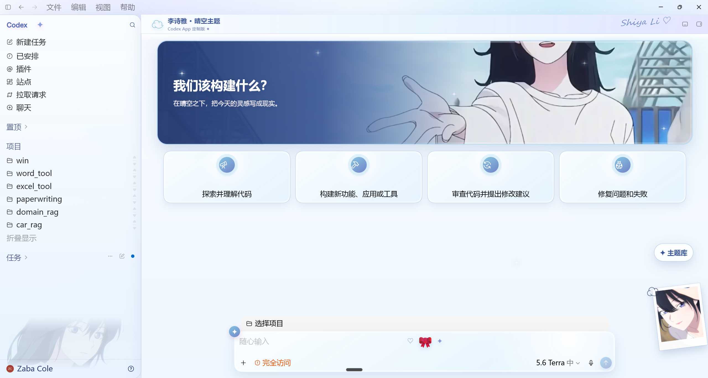
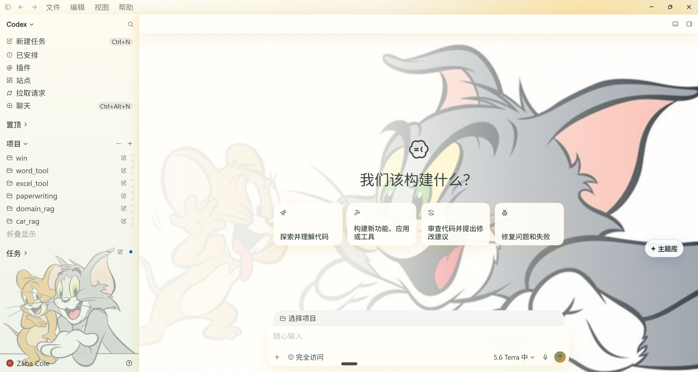
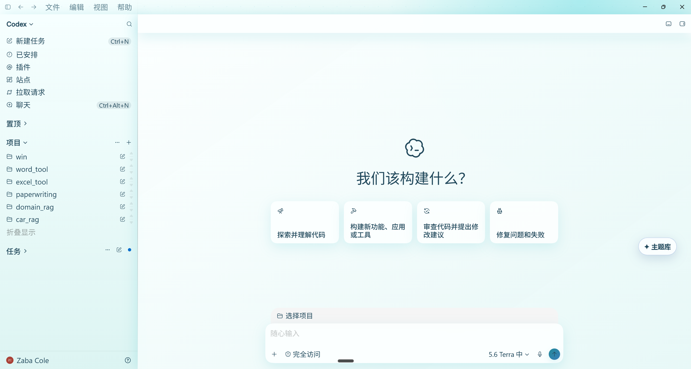

# Codex Dream Skin

  <strong>中文</strong> · <a href="./README.en.md">English</a>

  <strong>给 Codex 桌面端换一张会呼吸的脸。</strong> 
  外部主题 / 换肤工具 · 本机 CDP 注入 · 不改官方安装包

  一张图，一种心情 · 写代码，也要有氛围感

  非 OpenAI 官方产品。不修改 <code>.app</code> / <code>app.asar</code> / WindowsApps。

## 效果预览

一张图，一种心情。下面都是可落地的主题示意效果：

### 主题库实机效果

以下三张截图来自 Windows 主题库的真实 Codex 窗口：主题不会修改官方安装目录；人物图片仅作为本地示例，公开仓库不内置这些原图。

   
  李诗雅 · 晴空：蓝白轻盈首页

   
  猫和老鼠：中央主背景 + 横向侧栏第二张图

   
  清透水青：无图片 CSS 样板主题

其余历史样式：

   
  粉系定制

   
  财神打工版

   
  红白科幻

   
  清透定制

   
  灵感小宇宙

   
  紫夜限定

   
  初音未来

   
  舞台黑金

## 它能做什么

- **真·可交互**：侧栏、建议卡、项目选择、输入框都是原生控件，不是整窗假截图贴上去
- **可换图**：换一张喜欢的图，就能变成你的主题
- **可恢复**：一键还原官方外观
- **相对安全**：本机回环 CDP 注入，不改官方二进制与签名

## 手动主题库（Windows 试验版）

主题库不会在启动时自动改变 Codex。打开 Codex 后，通过单独入口向**当前窗口**加入“主题库”按钮，再从窗口右下角手动选择主题；关闭 Codex 后主题自然消失。

- 内置 12 种公共 CSS 样板：覆盖极简、自然、赛博、复古、阅读、暖调等方向；完整清单见 [`windows/THEMES.md`](./windows/THEMES.md)
- 右下角“主题库”标签可拖动，位置仅保存在本机；靠近边缘时面板自动向屏幕内展开
- 本机存在个人图片资源时，可额外出现个人主题卡；这些资源默认被 Git 忽略，不随仓库发布
- “官方外观”会立刻移除当前窗口的自定义样式

主题设计、版权边界和扩展规范见 [`windows/THEMES.md`](./windows/THEMES.md)。

## 快速开始

仓库内按平台放了现成脚本（实现细节不同，效果都是「主题化 Codex」）：

| 平台 | 目录 | 入口 |
|------|------|------|
| Apple Silicon / Intel Mac | [`macos/`](./macos/) | 双击 `Install Codex Dream Skin.command` |
| Windows | [`windows/`](./windows/) | `scripts/install-dream-skin.ps1` → `start-dream-skin.ps1` |

更细的说明：

- Mac：[`macos/README.md`](./macos/README.md)
- Windows：[`windows/SKILL.md`](./windows/SKILL.md)
- 路径对照：[`docs/platforms.md`](./docs/platforms.md)
- 项目记录：[`docs/PROJECT.md`](./docs/PROJECT.md)

## 反馈与贡献

- **Issue：** 请用 [Issue 模板](./.github/ISSUE_TEMPLATE/)（Bug / 功能）；已关闭空白 Issue。提交前建议先跑 Verify / Restore 自检。
- **PR：** 请按 [PR 模板](./.github/pull_request_template.md) 写清改动，并勾选对应自测（如 `macos/tests/run-tests.sh`、verify / restore）。

## 安全边界

- CDP 只绑 `127.0.0.1`，主题运行期间勿跑来路不明的本机程序
- 不修改官方安装目录与代码签名
- **不会**自动改写 API Key / Base URL；中转与换肤分开

## 许可与声明

- 见 [`macos/LICENSE`](./macos/LICENSE)（MIT）与 [`macos/NOTICE.md`](./macos/NOTICE.md)
- 非 OpenAI 官方产品；Codex 及相关权利归其权利人
- 效果图中的人物 / IP 形象仅作主题示意；商用或公开再分发请自行确认肖像权与商标授权

---

Star 一下，然后挑一张图，把你的 Codex 变成今天想要的样子。
